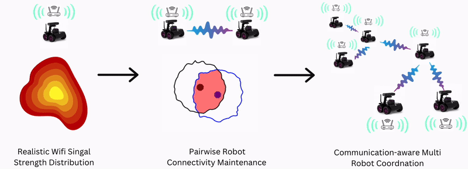

<h2 align="center"">Integrating Online Learning and Connectivity Maintenance for Communication-Aware Multi-Robot Coordination</h2> 

<p align="center">
   <a href="https://yupeng.blog/research/" style="font-size: 25px;">
        Yupeng Yang
    </a>
  ,
  <a href="https://www.cs.cmu.edu/~yiweilyu" style="font-size: 25px;">
        Yiwei Lyu
    </a>
  ,
  <a href="https://yanzezhang97.github.io/" style="font-size: 25px;">
        Yanze Zhang
    </a>
  , 
    <a href="https://www.linkedin.com/in/ian-gao-978667162/" style="font-size: 25px;">
        Ian Gao
    </a>
   and
    <a href="https://webpages.charlotte.edu/wluo4/" style="font-size: 25px;">
        Wenhao Luo
    </a>
</p>

<p align="center">
       
</p>

<p align="center">
<h3 align="center"><a href="https://arxiv.org/abs/2410.05798">Paper</a> | <a href="https://wenhaol.github.io/DCM-RSSI/">Dataset Description</a>|
<a href="https://youtu.be/sgx23-j_8Uo">Brief Presentation</a></h3>
</p>

<p align="center">
　This paper has been accepted to <a href="https://iros2024-abudhabi.org/">the 2024 IEEE/RSJ International Conference on Intelligent Robots and Systems (IROS 2024)</a>  
</p>

<p align="center">
      
   <p align="center"><em>Fig.1 Project Overview.</em><p>
</p>


<div align="center">

|  |  |  |
|:---------------------------------------------------------------------------------------------------------:|:---------------------------------------------------------------------------------------------------------:|:---------------------------------------------------------------------------------------------------------:|
| (a) | (b)  | (c) |
<p align="center">
<em>Fig. 2. Example of connectivity maintenance between two robots with spatially varying communication performance  (a) RSSI value (dB) distribution as the transmitter robot moves in the 2D space. The red contour line indicates the region where signal from the robot can be received with satisfying RSSI level for "high-quality" communication. (b) Pairwise robot connectivity maintenance considering the realistic signal strength distribution.The overlapping area signifies the region where signal from both robots can be received with satisfying RSSI level. The robots consistently remain within this overlapping region, ensuring they remain strongly connected. (c) Pairwise robot connectivity maintenance using a disc-based communication model, where the robots cannot adaptively change their communication range according to the signal distribution, making them prone to losing "high-quality" communication.</em>
</p>
</div>

### Overview
In this paper, we integrate online learning of communication signal strength with a bi-level optimization-based control framework for communication-preserved multi-robot coordination. This approach
1. enables the construction of point-to-point communication map online, 
2. adaptively constrains robots' motion using the learned communication map so that the multi-robot communication graph remains globally connected with satisfying RSSI levels, and
3. minimally impacts the original task-related robot motion as a result of the co-optimized connectivity maintenance and control performance.

This repository contains:

<ul style="list-style-type:circle"> <li><b><a href="#rssi-dataset">RSSI Dataset:</a></b> A collected dataset of point-to-point Received Signal Strength Indicator (RSSI) measurements for experimental validation, which may be useful for future research in communication-aware robotics research in the community.</li> <li><b><a href="#experiment-video">Experiment Video:</a></b> A video demonstrating the experimental validation of our approach as presented in the IROS paper.</li> </ul>


<h3 id="rssi-dataset">RSSI Dataset</h3>
<p>We have established a point-to-point Received Signal Strength Indicator (RSSI) dataset, which can be found in the <a href="Dataset">dataset folder</a>. Detailed information related to this dataset is available at this <a href="https://wenhaol.github.io/DCM-RSSI/">link</a>. The router information can be found <a href="router_info.csv">here</a>. Furthermore, we provide an interactive visualization feature that allows users to click on each transmitter robot position, instantly displaying the corresponding heatmap of RSSI distribution at that specific location. This interactive tool offers a more intuitive understanding of the point-to-point WiFi signal distribution throughout the environment.</p>


<p align="center">
    
   <p align="center"><em>Fig.3 Heatmap of RSSI distribution with different transmitter robot positions.</em></p>
<p>The GIF illustrates how the received signal strength values shift based on the transmitter robot's position. Each frame represents a heatmap showing the RSSI across the environment, with varying colors depicting the strength of the WiFi signal. 


<h3 id="experiment-video"> Experiment Video</h3>


<video src="https://github.com/user-attachments/assets/3466f108-51fc-42f2-bdc8-751a1ca2ab79"></video>
<p align="center"><em>Experiment Video.</em></p>


In this video, we compare our approach with the MCCST method [[4]](https://ieeexplore.ieee.org/document/9197429), which employs a disc-based communication model with a fixed communication range. 

For MCCST with a short pre-determined communication range (i.e., 0.7 m), the robots maintain strong connectivity and ensure the required safety. However, due to the limited predefined communication range, the robots' motion is overly constrained by distance-based connectivity control constraints, hindering their ability to perform their original tasks effectively. Conversely, with MCCST using a long pre-determined communication range (i.e., 1.2 m), the robots fail to maintain strong connectivity because the connectivity constraints are not sufficiently enforced at greater distances.

In contrast, the video demonstrates that our proposed method consistently ensures that the robot team remains strongly connected over time. By utilizing online RSSI data, our method adaptively adjusts the effective communication range, ensuring strong connectivity of the robot team while achieving optimal task performance.

### Cite Us

Please consider to cite our paper if you find them helpful to your research.

```latex 
@inproceedings{yang2024integrating,
  title={Integrating Online Learning and Connectivity Maintenance for Communication-Aware Multi-Robot Coordination},
  author=Yang, Yupeng and Lyu, Yiwei and Zhang, Yanze and Gao, Ian and Luo, Wenhao},
  booktitle={2024 IEEE/RSJ International Conference on Intelligent Robots and Systems (IROS)},
  year={2024},
  organization={IEEE}
}
```
Please also check our other relevant work on multi-robot connectivity maintenance: 

1. Yang, Yupeng, Yiwei Lyu, Yanze Zhang, Sha Yi, and Wenhao Luo. "Decentralized Multi-Robot Line-of-Sight Connectivity Maintenance under Uncertainty." *Proceedings of Robotics: Science and Systems*, Delft, Netherlands, July 2024. [[bibtex]](https://wenhaol.github.io/DCM-RSSI/Decentralized_RSS24.html)

2. Yang, Yupeng, Yiwei Lyu, and Wenhao Luo. "Minimally constrained multi-robot coordination with line-of-sight connectivity maintenance." *2023 IEEE International Conference on Robotics and Automation (ICRA)*. IEEE, 2023. [[bibtex]](https://wenhaol.github.io/DCM-RSSI/los_icra23.html)

3. Luo, Wenhao, Nilanjan Chakraborty, and Katia Sycara. "Minimally disruptive connectivity enhancement for resilient multi-robot teams." *2020 IEEE/RSJ International Conference on Intelligent Robots and Systems (IROS)*. IEEE, 2020. [[bibtex]](https://wenhaol.github.io/DCM-RSSI/Disruptive_iros20.html)

4. Luo, Wenhao, Sha Yi, and Katia Sycara. "Behavior mixing with minimum global and subgroup connectivity maintenance for large-scale multi-robot systems." *2020 IEEE International Conference on Robotics and Automation (ICRA)*. IEEE, 2020. [[bibtex]](https://wenhaol.github.io/DCM-RSSI/Behavior_icra20.html)

5. Luo, Wenhao, and Katia Sycara. "Minimum k-connectivity maintenance for robust multi-robot systems." *2019 IEEE/RSJ International Conference on Intelligent Robots and Systems (IROS)*. IEEE, 2019. [[bibtex]](https://wenhaol.github.io/DCM-RSSI/Minimumk_iros19.html)


### Acknowledgements
This work was supported in part by the U.S. National Science Foundation under Grant CMMI-2301749.

<p align="right">
     
</p>


